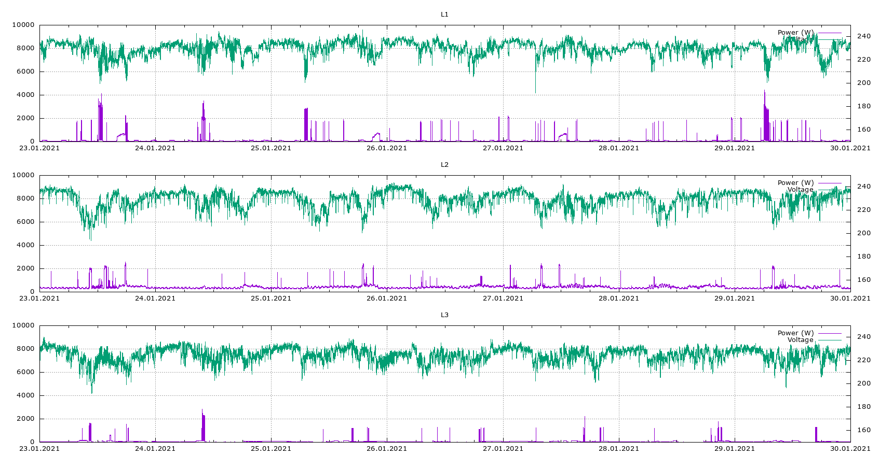

This is a collection of scripts to collect data from the [Shelly EM3](https://shelly.cloud/products/shelly-3em-smart-home-automation-energy-meter/) energy meter.

## Data Collection

The energy meter has `/status` end-point that returns a snapshot of the current and historical power usage. See `status-sample.json`.

A subset of the data is collected as a CSV file by the `extract` and `transform` scripts.
This includes the voltage (V), power usage (W) and total consumed power (Wh) for phases L1-L3.

I use a simple Gnuplot script to create graphs like these:


## Prerequisites

The scripts use [jq](https://stedolan.github.io/jq/) and [Gnuplot](http://gnuplot.info/).

## Crontab Entry

Sample crontab entry to run the collection script every minute:

```crontab
# minute    hour    mday    month   wday    command
  */1       *       *       *       *       /shelly-em3/extract
```
