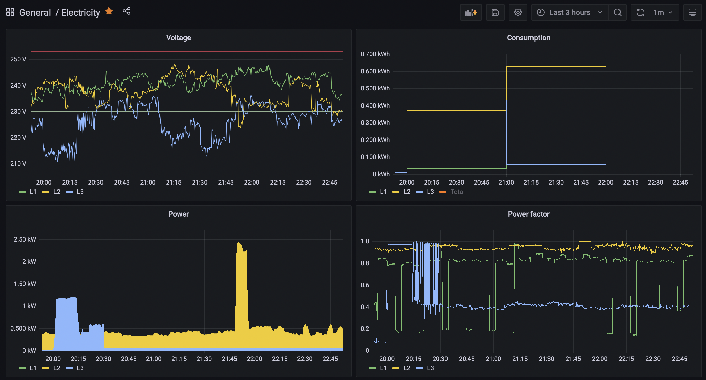

# Shelly 3EM – Dashboard

This is a sample set-up to collect data from the [Shelly 3EM](https://shelly.cloud/products/shelly-3em-smart-home-automation-energy-meter/) energy meter.

The data is plotted on a dashboard using Grafana:

## Prerequisites

* InfluxDB 1.8
* Grafana 8.1
* Telegraf 1.2

## Data Collection

The energy meter has `/status` end-point that returns [a snapshot](status-sample.json) of the current and total power usage.

The device is polled every 10 seconds by a [Telegraf](https://docs.influxdata.com/telegraf/v1.20/) agent. It collects the fields related to electricity usage and sends them to the database:

* Voltage.
* Momentary power usage.
* Total consumed power.

The Telegraf service configuration is in [`telegraf/`](telegraf):

## Database

The [InfluxDB](https://docs.influxdata.com/influxdb/v1.8/) database is configured to retain high-resolution data for 1 year.

A subset of the data is down-sampled to 1 hour resolution and retained for 2 years:
* Minimum voltage.
* Maximum momentary power.
* Total power usage.

The script to set up the database and the continuous queries is in [`influxdb/`](influxdb):

## Dashboard

Two [Grafana](https://grafana.com/docs/grafana/latest/) dashboards show real-time and historical data.

The dashboards can be imported from [`grafana/`](grafana).

